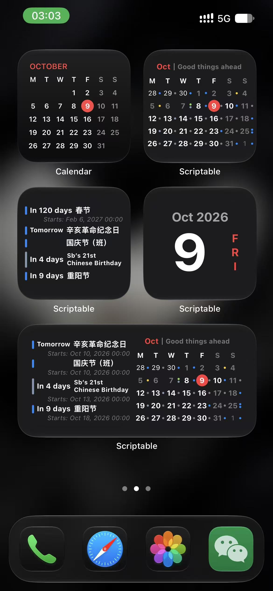
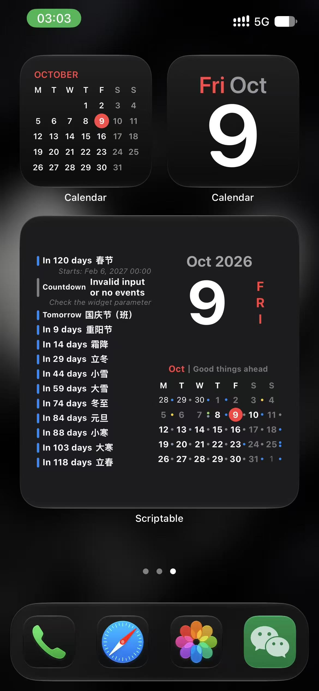
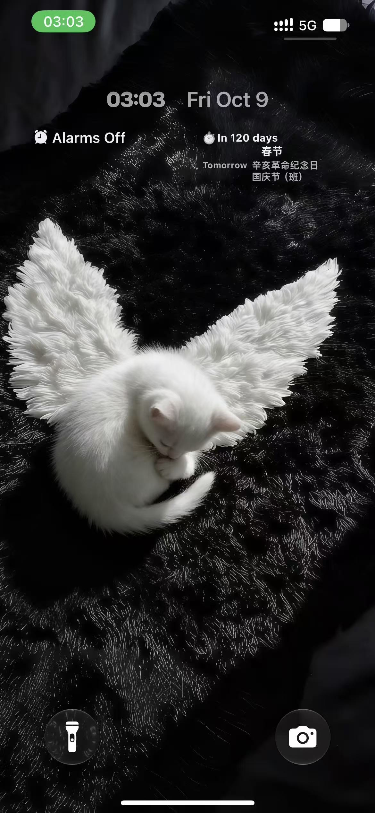

# Calendar Event Countdown

一款为 [Scriptable](https://scriptable.app/) 编写的双语日历与事件倒数日小组件。一个脚本即可覆盖 iPhone 锁屏矩形组件、主屏幕小号/中号/大号组件，以及 iPadOS 超大号组件。

[中文使用说明](./使用说明.md) · [English User Guide](./USER_GUIDE.md) · [许可声明](./LICENSE.md)

## 主要特性

- 从 Apple 日历读取事件，按开始时间与结束时间排序。
- 可查询单个日历、多个日历、完整事件标题或标题关键词。
- 使用 `.` 组合多个独立查询，并优先保留每组的重要事件。
- 显示“此刻、今天、明天、后天、N 天后”等相对日期；也支持最近的历史事件。
- 事件色条、圆点或标题颜色跟随所属日历颜色。
- 中英文界面自动跟随系统，也可固定为中文或英文。
- 中英文时间均采用 24 小时制。
- 倒数日标题支持两行显示；相邻同日事件隐藏重复日期标签并保留等宽占位。
- 提供月历、今日日期、节假日/调休识别和生日标题隐私处理。
- 只读取日历，不创建、修改或删除事件；不调用外部接口，也不需要联网。

## 效果预览

<table>
  <tr>
    <td align="center"><br><sub>English · Small / Medium</sub></td>
    <td align="center"><br><sub>English · Large</sub></td>
    <td align="center"><br><sub>English · Lock Screen</sub></td>
  </tr>
  <tr>
    <td align="center"><br><sub>中文 · 小号 / 中号</sub></td>
    <td align="center"><br><sub>中文 · 大号</sub></td>
    <td align="center"><br><sub>中文 · 锁屏</sub></td>
  </tr>
</table>

项目暂未附带 iPadOS 超大号组件截图，但脚本已实现该尺寸。

## 快速开始

1. 在 iPhone 或 iPad 上安装 Scriptable。
2. 在 Scriptable 中新建脚本，将 [`CalendarEventCountdown.js`](./CalendarEventCountdown.js) 的全部代码复制进去，并保存为 `CalendarEventCountdown`。
3. 在 Scriptable 中运行一次脚本，允许读取日历。
4. 添加 Scriptable 小组件，选择该脚本并填写小组件参数。

完整的安装、参数和配置说明见 [中文使用说明](./使用说明.md) 或 [English User Guide](./USER_GUIDE.md)。

## 参数速查

| 需求 | 参数示例 |
| --- | --- |
| 所有日历中最近的事件 | 留空 |
| 一个日历 | `工作` |
| 合并多个日历 | `工作/生活/家庭` |
| 按事件标题查询 | `纪念日` |
| 优先一个事件，再用日历事件补足 | `重要纪念日.工作/生活` |
| 小号组件只显示月历 | `$month` |
| 小号组件只显示今日日期 | `$today` |

`.` 分隔独立查询组，`/` 只用于把多个日历合并为一组。锁屏矩形组件最多支持 2 组查询，主屏幕和 iPadOS 组件最多支持 5 组。

## 组件布局

| 组件尺寸 | 显示内容 |
| --- | --- |
| 锁屏矩形 | 重点倒数日与后续事件 |
| 小号 | 倒数日列表；使用 `$month` 或 `$today` 可切换为月历或今日日期 |
| 中号 | 左侧倒数日，右侧月历 |
| 大号 | 左侧倒数日，右上今日日期，右下月历 |
| iPadOS 超大号 | 左侧倒数日，右侧宽版月历及事件标题 |

目前未实现锁屏圆形与行内组件。

## 可配置项

常用设置位于脚本顶部：

```javascript
const weekStartsMonday = true;
const hideOtherMonth = false;
const showRestFeature = true;
const hideRestEvent = true;
const restCalendarTitle = "中国大陆节假日";
const restEventTitle = "（休）";
const workEventTitle = "（班）";
const languageMode = "auto"; // auto、zh 或 en
const monthSubtitle = {
  zh: "美好即将发生",
  en: "Good things ahead"
};
```

- `weekStartsMonday`：月历是否从周一开始。
- `hideOtherMonth`：是否隐藏月历中相邻月份的日期。
- `showRestFeature`：是否根据节假日日历区分休息日和调休工作日。
- `hideRestEvent`：是否隐藏节假日事件本身的圆点或标题。
- `restCalendarTitle`、`restEventTitle`、`workEventTitle`：节假日数据的识别规则。
- `languageMode`：自动跟随系统，或固定为中文/英文。
- `monthSubtitle`：月份右侧的双语文字；两个值均设为 `""` 可隐藏。

## 查询与显示逻辑

- 普通查询范围为当前时刻至五年后，每组最多保留排序后的前 20 条事件。
- 单项参数优先按完整日历名称查找；找不到日历时，再按事件标题查询。
- 标题查询先进行完全匹配，没有结果时再进行包含匹配。
- 未来五年没有匹配项时，按年向前查找完全同名的历史事件，最多回溯 100 年。
- 多组查询中，脚本优先保留前面各组最近且不重复的事件，再由最后一组补足剩余空间。
- 正在进行或已经过去的重点事件显示结束时间，未来事件显示开始时间。
- 主屏幕倒数日标题最多两行；空间不足时停止添加后续事件。
- 相邻事件的相对日期相同时，后一个日期标签透明但保留等宽区域，使标题对齐。

## 月历规则

- 默认以周一为每周第一天，并显示月初、月末相邻月份日期。
- 周末变淡，今天以红底白字突出显示。
- 普通月历每天最多显示 4 个日历色圆点。
- iPadOS 宽版月历每天最多显示 4 个彩色事件标题。
- 默认识别 `中国大陆节假日` 日历中的 `（休）` 和 `（班）`，并隐藏这些事件自身的普通标记。

## 本地化与隐私

`languageMode = "auto"` 时，系统语言代码以 `zh` 开头则使用中文，其余语言使用英文。界面文字、相对日期、月份、星期和时间标签会本地化；用户自己的日历名称、事件标题和参数不会被翻译。

生日事件会进行简单脱敏：

```text
张三的21岁生日 → 某人的21岁生日
John’s Birthday → Sb’s Birthday
```

英文规则兼容 `'`、`’` 和 `ʼ` 三种撇号。没有匹配到对应姓名格式时，标题保持原样。

## 项目文件

| 文件 | 内容 |
| --- | --- |
| [`CalendarEventCountdown.js`](./CalendarEventCountdown.js) | Scriptable 主脚本 |
| [`使用说明.md`](./使用说明.md) | 中文用户指南 |
| [`USER_GUIDE.md`](./USER_GUIDE.md) | English user guide |
| [`LICENSE.md`](./LICENSE.md) | 许可与署名要求 |
| [`previews`](./previews) | 组件截图 |

主要函数包括：`createWidget()` 负责按尺寸选择布局；`setLockWidget()`、`setDayMatterWidget()`、`setTodayWidget()`、`setMonthWidget()` 和 `setBigMonthWidget()` 负责绘制各类视图；`getEventsBy()` 与 `getMonDic()` 读取事件；`dealEvents()` 负责相对日期、本地化时间和生日标题处理。

## 实现概览

脚本首先读取 `args.widgetParameter` 并根据 `config.widgetFamily` 选择布局，然后通过 Scriptable 的日历 API 获取事件。倒数日查询结果先排序、限制数量并转换为统一数据结构，再交给对应的绘制函数；月历则生成覆盖完整周的日期网格，逐日读取事件并绘制标记。

| 函数 | 职责 |
| --- | --- |
| `createWidget()` | 解析组件尺寸与特殊参数，组合整体布局 |
| `setLockWidget()` | 绘制锁屏矩形倒数日 |
| `addLockEventRow()` | 绘制锁屏事件行及同日等宽占位 |
| `setDayMatterWidget()` | 绘制主屏幕倒数日列表并控制可见数量 |
| `setTodayWidget()` | 绘制今日日期与星期 |
| `setMonthWidget()` | 绘制普通月历和事件圆点 |
| `setBigMonthWidget()` | 绘制 iPadOS 宽版月历和事件标题 |
| `getEventsBy()` | 按参数查询、排序和筛选事件 |
| `getMonDic()` | 建立月历日期与事件的映射 |
| `dealEvents()` | 生成相对日期、格式化时间并处理生日标题 |
| `calendarCal()` | 生成以完整周排列的当月日期网格 |
| `tr()`、`formatRelativeDay()` | 提供中英文界面文字 |

相关 Scriptable API：[`ListWidget`](https://docs.scriptable.app/listwidget/)、[`WidgetStack`](https://docs.scriptable.app/widgetstack/)、[`Calendar`](https://docs.scriptable.app/calendar/)、[`CalendarEvent`](https://docs.scriptable.app/calendarevent/)、[`DateFormatter`](https://docs.scriptable.app/dateformatter/)、[`Device`](https://docs.scriptable.app/device/)。

## 当前限制

- 只支持锁屏矩形组件，不支持锁屏圆形和行内组件。
- `$month` 与 `$today` 仅在小号组件中、且作为唯一参数时生效。
- 参数中的 `.` 与 `/` 不能转义，因此不适合直接查询包含这些分隔符的标题。
- 没有设置组件或事件的点击跳转地址。
- 刷新时间由 iOS / iPadOS 和 Scriptable 调度，不保证实时更新。
- iPadOS 超大号组件仅能在支持该尺寸的设备和系统上使用。

## 版权与许可

Copyright © Shelus2021.

本项目采用 [PolyForm Noncommercial License 1.0.0](https://polyformproject.org/licenses/noncommercial/1.0.0)。允许为非商业目的使用、修改和再分发，但必须保留原作者 Shelus2021 的署名及许可信息；商业使用需事先取得作者书面许可。完整条款见 [`LICENSE.md`](./LICENSE.md)。
