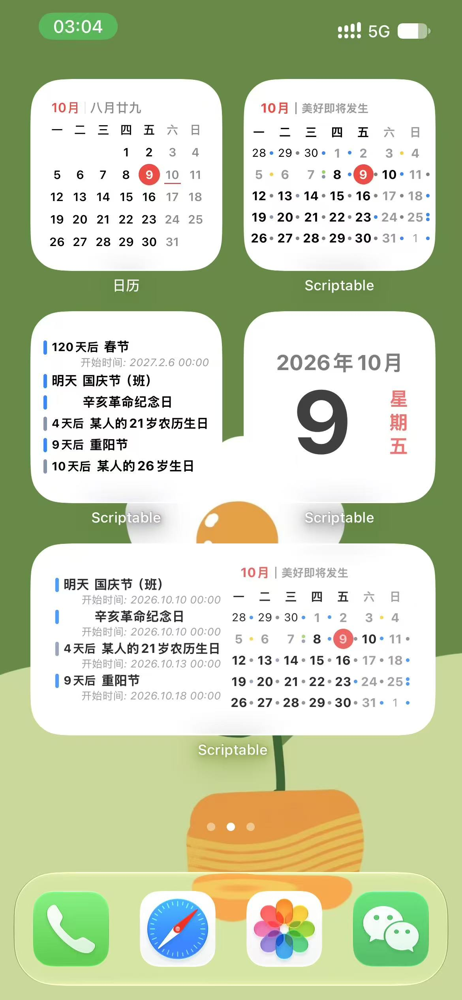
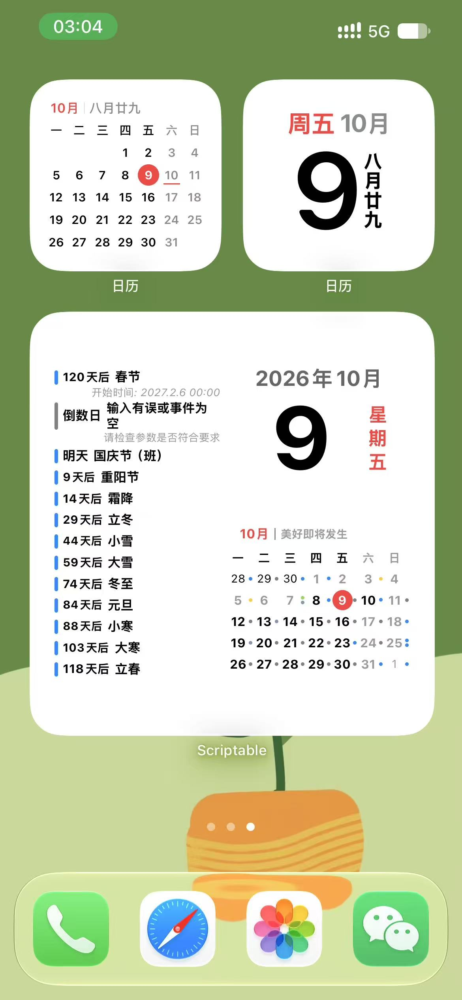
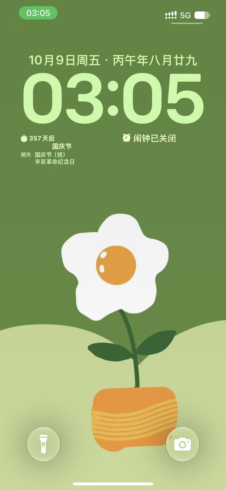

# Calendar Event Countdown 使用说明

Calendar Event Countdown 是一款运行于 Scriptable 的双语日历与事件倒数日小组件，支持 iPhone 锁屏、主屏幕和 iPadOS 超大号组件。

[English User Guide](./USER_GUIDE.md) · [项目说明](./README.md)

## 安装

1. 在 iPhone 或 iPad 上安装 [Scriptable](https://scriptable.app/)。
2. 在 Scriptable 中新建脚本。
3. 复制 [`CalendarEventCountdown.js`](./CalendarEventCountdown.js) 的全部内容，脚本名称填写 `CalendarEventCountdown`。
4. 运行一次脚本，并允许 Scriptable 读取日历。

脚本只读取日历和事件，不会创建、修改或删除内容，也不会发送网络请求。

## 添加小组件

### 主屏幕

1. 长按主屏幕空白处，添加 **Scriptable** 小组件。
2. 选择小号、中号或大号。
3. 长按小组件并选择“编辑小组件”。
4. 在“脚本”中选择 `CalendarEventCountdown`。
5. 在“参数”中填写查询内容；留空则显示所有日历中最近的事件。

### 锁屏

编辑锁屏，添加 Scriptable 的矩形组件，然后选择 `CalendarEventCountdown`。当前仅支持锁屏矩形组件。

### iPadOS 超大号

添加 Scriptable 超大号组件并选择本脚本。该尺寸是否可用取决于设备与系统版本。

## 参数用法

### 常用示例

| 想要的内容 | 参数 |
| --- | --- |
| 所有日历中最近的事件 | 留空 |
| “工作”日历 | `工作` |
| 合并“工作”和“生活”日历 | `工作/生活` |
| 标题为或包含“纪念日”的事件 | `纪念日` |
| 优先显示纪念日，再用两个日历补足 | `纪念日.工作/生活` |
| 小号组件仅显示月历 | `$month` |
| 小号组件仅显示今日日期 | `$today` |

示例名称需要替换为你设备中真实存在的日历名称或事件标题。

### 分隔符

- `.`：分隔独立查询组，例如 `生日.纪念日.工作`。
- `/`：把多个完整日历名称合并为一组，例如 `工作/生活/家庭`。

`/` 只适合连接日历名称。参数中的 `.` 和 `/` 无法转义。

### 查询规则

- 一个普通参数会先匹配完整的日历名称；找不到该日历时，才搜索事件标题。
- 标题搜索先完全匹配，没有结果时再搜索包含该文字的标题。
- 多组参数会优先保留前面各组最近且不重复的事件，最后一组用于补足剩余位置。重要内容应放在前面。
- 锁屏矩形组件最多使用 2 组参数；其他组件最多使用 5 组。
- `$month` 和 `$today` 仅在小号组件中作为唯一参数时有效。

## 各尺寸显示内容

| 尺寸 | 内容 |
| --- | --- |
| 锁屏矩形 | 重点倒数日与后续事件 |
| 小号 | 倒数日列表；也可单独显示月历或今日日期 |
| 中号 | 左侧倒数日，右侧月历 |
| 大号 | 左侧倒数日，右上今日日期，右下月历 |
| iPadOS 超大号 | 左侧倒数日，右侧宽版月历与事件标题 |

### 中文效果预览







## 倒数日显示规则

- 根据事件时间显示“此刻、今天、明天、后天、N 天后、昨天、前天、N 天前”。
- 未来事件显示开始时间；正在进行或已过去的重点事件显示结束时间。
- 时间统一使用 24 小时制。
- 事件色条使用所属日历的颜色。
- 主屏幕标题最多显示两行，最小缩放比例为 0.8；空间不足时不再添加后续事件。
- 相邻事件倒数日相同时，后一个日期标签会隐藏，但保留相同宽度，使标题对齐。该规则同时用于主屏幕与锁屏列表。
- 普通查询会读取当前时刻至五年后的事件，每组最多保留前 20 条。
- 未来没有结果时，会按年查找完全同名的历史事件，最多回溯 100 年。

## 生日标题隐私处理

脚本会自动隐藏常见生日标题中的姓名：

```text
张三的21岁生日 → 某人的21岁生日
John's Birthday → Sb's Birthday
John’s Birthday → Sb’s Birthday
Johnʼs Birthday → Sbʼs Birthday
```

中文标题需包含“生日”和“的”；英文标题需包含 `birthday` 和姓名后的 `'s`、`’s` 或 `ʼs`。不符合这些格式时保持原样。

## 月历功能

- 默认从周一开始，并显示相邻月份的日期。
- 周末日期变淡；今天使用红底白字突出显示。
- 普通月历每天最多显示 4 个彩色事件圆点。
- iPadOS 宽版月历每天最多显示 4 个彩色事件标题。
- 月份右侧可以显示自定义的中英文短句。

### 节假日与调休

默认识别名为 `中国大陆节假日` 的日历：

- 标题含 `（休）`：日期按休息日变淡。
- 标题含 `（班）`：日期按调休工作日正常显示。
- 节假日事件本身默认不显示为普通圆点或标题。

如果日历名称或标记不同，请修改脚本顶部对应配置。

## 语言设置

默认设置为：

```javascript
const languageMode = "auto";
```

- `auto`：系统语言以 `zh` 开头时显示中文，其他情况显示英文。
- `zh`：固定中文。
- `en`：固定英文。

界面文字、相对日期、月份、星期和时间标签会切换语言。日历名称、事件标题和参数属于用户数据，不会自动翻译。

## 常用配置

在脚本顶部修改：

```javascript
const weekStartsMonday = true;      // 周一作为每周第一天
const hideOtherMonth = false;       // 显示相邻月份日期
const showRestFeature = true;       // 启用节假日/调休样式
const hideRestEvent = true;         // 隐藏节假日事件标记
const restCalendarTitle = "中国大陆节假日";
const restEventTitle = "（休）";
const workEventTitle = "（班）";
const languageMode = "auto";        // auto、zh 或 en
const monthSubtitle = {
  zh: "美好即将发生",
  en: "Good things ahead"
};
```

若不需要月份右侧文字：

```javascript
const monthSubtitle = { zh: "", en: "" };
```

## 常见问题

### 显示“输入有误或事件为空”

请检查参数组是否超出上限、日历名称是否完全一致、`/` 连接的每个日历是否存在、事件是否在查询范围内，以及 Scriptable 是否具有日历权限。

### 某个事件没有显示

事件按时间排序，并受查询优先级、重复项去除和组件可用空间影响。请把最重要的查询放在参数最前面。

### 修改日历后没有立即更新

小组件刷新由 iOS / iPadOS 调度。可在 Scriptable 中运行脚本查看最新预览，或等待系统刷新。

### 切换语言后没有立即变化

等待系统刷新，或在 Scriptable 中运行脚本。也可以暂时将 `languageMode` 改为 `zh` 或 `en` 检查效果。

### 月历加载较慢

月历需要读取完整网格中每一天的事件，日历较多或事件密集时会比纯倒数日模式慢。

## 使用限制

- 不支持锁屏圆形与行内组件。
- 不支持为组件或事件设置点击跳转。
- 参数中的 `.` 与 `/` 不能转义。
- 刷新时间由系统决定。

## 版权与许可

Copyright © Shelus2021.

允许为非商业目的使用、修改和再分发，但必须保留 Shelus2021 的署名及许可信息。不得用于销售、收费产品、收费服务或其他商业用途，除非事先取得作者书面许可。完整条款见 [`LICENSE.md`](./LICENSE.md)。

